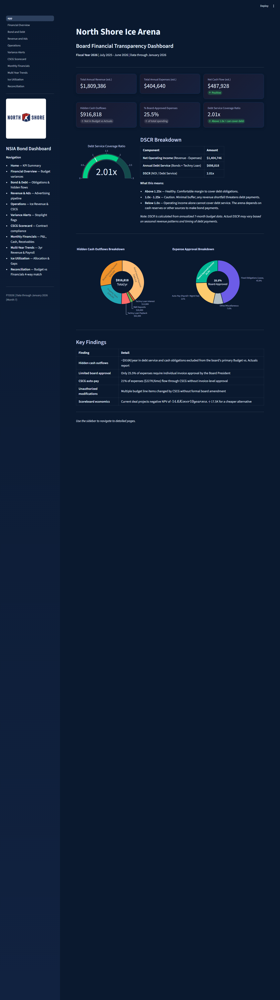
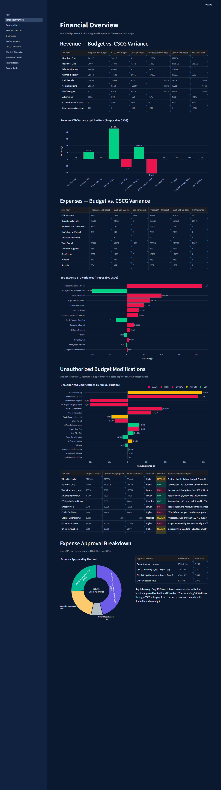
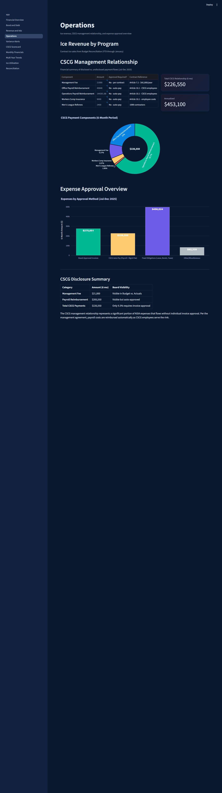
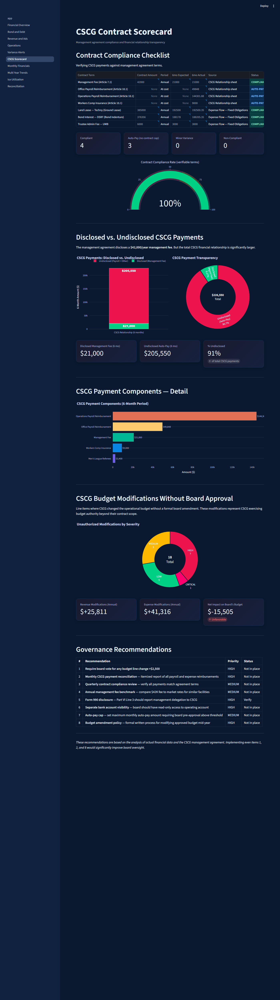
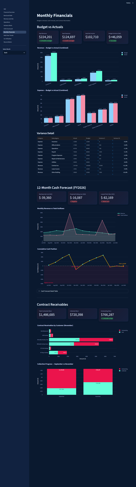
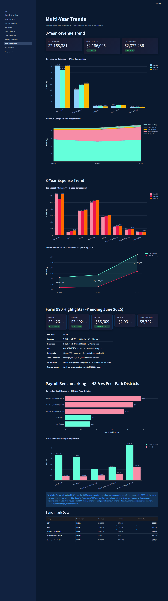
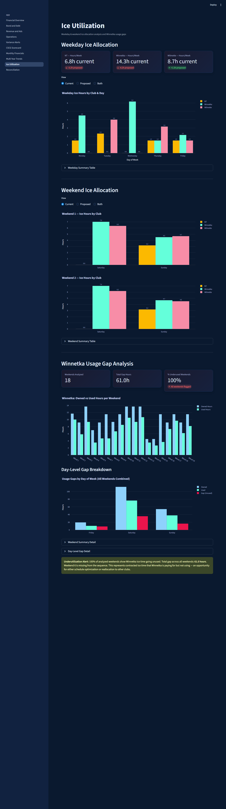
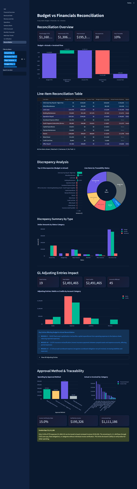

# NSIA Bond Dashboard

Board financial transparency dashboard for the North Shore Ice Arena (NSIA). Built with Streamlit, Plotly, and Pandas.

**Fiscal Year 2026** | July 2025 - June 2026 | Data through January 2026

## Quick Start

```bash
pip install -r requirements.txt
streamlit run app.py
```

## Pages

### Home — KPI Summary
Top-level metrics: revenue, expenses, net cash flow, hidden outflows, DSCR gauge, and expense approval breakdown.



---

### 1. Financial Overview — Budget Variances
Revenue and expense budget vs. CSCG variance analysis, unauthorized budget modifications, and expense approval breakdown.



---

### 2. Bond & Debt — Obligations & Hidden Flows
Hidden cash flows (\$916K/yr), annual debt service waterfall, fixed obligations, and scoreboard economics NPV comparison.


---

### 3. Revenue & Ads — Advertising Pipeline
Current advertisers, done deals vs. prospects pipeline, historical ad revenue (2014-2024), and scoreboard sponsorship revenue model.


---

### 4. Operations — Ice Revenue & CSCG
CSCG management relationship breakdown, payment components, expense approval overview, and disclosure summary.



---

### 5. Variance Alerts — Stoplight Flags
RED/YELLOW/GREEN stoplight system for all budget line items. RED alerts require board attention, YELLOW items need monitoring.


---

### 6. CSCG Scorecard — Contract Compliance
Contract compliance checklist, disclosed vs. undisclosed CSCG payments, budget modifications without board approval, and governance recommendations.



---

### 7. Monthly Financials — P&L, Cash, Receivables
Budget vs. actuals by month, 12-month cash forecast, and contract receivables with collection progress.



---

### 8. Multi-Year Trends — 3yr Revenue & Payroll
3-year revenue and expense trends, Form 990 highlights, and payroll benchmarking vs. peer park districts.



---

### 9. Ice Utilization — Allocation & Gaps
Weekday and weekend ice allocation by club (current vs. proposed), and Winnetka usage gap analysis.



---

### 10. Reconciliation — Budget vs Financials 4-Way Match
4-way reconciliation across Budget, Financials, GL, and Invoices. Line-item discrepancy analysis, GL adjusting entries impact, and approval traceability.



## Data Sources

| Source | File | Description |
|--------|------|-------------|
| Budget Reconciliation | `data/budget_reconciliation.xlsx` | Revenue/expense budget vs CSCG comparison |
| Expense Flow | `data/expense_flow.xlsx` | Expense approval methods and CSCG relationship |
| Scoreboard Economics | `data/scoreboard_economics.xlsx` | 10-year scoreboard NPV projections |
| Current Ads | `data/current_ads.xlsx` | Active advertisers and contracts |
| Done Deals / Prospects | `data/done_deals_prospects.xlsx` | Sales pipeline |
| Hockey Schedule | `data/hockey_schedule.csv` | Game schedule and results |
| Monthly P&L | `data/monthly_pnl.csv` | Monthly budget vs actuals |
| Cash Forecast | `data/cash_forecast.csv` | 12-month cash projection |
| Contract Receivables | `data/contract_receivables.csv` | Outstanding receivables |
| Multi-Year Revenue | `data/multiyear_revenue.csv` | 3-year revenue/expense by category |
| Payroll Benchmarks | `data/payroll_benchmarks.csv` | Peer district comparisons |
| Ice Weekday Breakdown | `data/ice_weekday_breakdown.xlsx` | Weekday ice allocation by club |
| Ice Weekend Breakdown | `data/ice_weekend_breakdown.xlsx` | Weekend ice allocation by club |
| Winnetka Usage Gaps | `data/winnetka_usage_gaps.xlsx` | Weekend usage gap analysis |
| General Ledger | `data/general_ledger.xlsx` | 588 GL transactions Jul-Jan |
| Bills Summary | `data/bills_summary.xlsx` | 111 board-approved invoices |
| Proposed Entries | `data/proposed_entries.xlsx` | 19 year-end adjusting journal entries |

## Tech Stack

- **Streamlit** — Web framework
- **Plotly** — Interactive charts
- **Pandas** — Data processing
- **openpyxl** — Excel file reading
